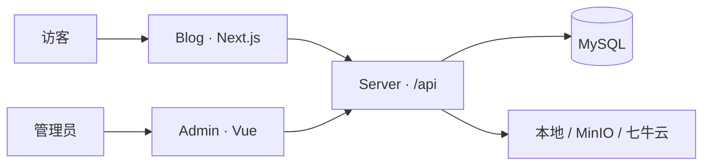

# My House · 生活档案馆（Blog）

一个面向个人博客与私人生活归档的前台站点。它不只承载文章，也用于整理影像、足迹、近况、恋爱记录、时间信件、成就与访客反馈。


## 项目预览

<!--
将桌面端截图保存为 docs/images/home-desktop.png 后，用下面这行替换截图占位：

-->

<div align="center">
  <br />
  <strong>📷 截图占位 · 首页桌面端</strong>
  <br />
  <sub>建议尺寸：1600 × 900</sub>
  <br /><br /><br />
</div>

<!--
将移动端截图保存为 docs/images/home-mobile.png 后，用下面这行替换截图占位：

-->

<div align="center">
  <br />
  <strong>📱 截图占位 · 首页移动端</strong>
  <br />
  <sub>建议尺寸：390 × 844</sub>
  <br /><br /><br />
</div>

## 三端组成

| 项目 | 职责 | 仓库 |
| --- | --- | --- |
| Blog | 面向访客的博客与生活档案前台 | **当前仓库** |
| Admin | 内容与站点配置管理后台 | [spring_admin](https://github.com/RRTiamo/spring_admin) |
| Server | API、鉴权、数据库与文件存储 | [spring_server](https://github.com/RRTiamo/spring_server) |



## 主要功能

- 文章列表、分类、归档、搜索与 Markdown 正文阅读
- 照片墙、足迹地图、随笔便签与个人成就
- “此时此刻”、关于作者和可动态配置的站点信息
- 恋爱纪实、愿望清单、时间胶囊与岁月信箱
- 鱼塘反馈、点赞、回复及友情链接
- 响应式布局、明暗主题和基于 GSAP / Lenis 的页面动效
- 服务端与浏览器端分离的 API 地址配置

## 技术栈

- Next.js 16 App Router
- React 19 + TypeScript 5
- Tailwind CSS 4
- Axios
- GSAP + ScrollTrigger、Lenis、Framer Motion
- Leaflet、Highlight.js

## 本地运行

### 环境要求

- Node.js `>= 20.9.0`
- npm
- 已启动的 [spring_server](https://github.com/RRTiamo/spring_server)，默认地址为 `http://localhost:8080/api`

### 1. 获取项目

```bash
git clone https://github.com/RRTiamo/spring_blogs.git
cd spring_blogs
npm ci
```

### 2. 配置开发环境

项目根目录创建或修改 `.env.development`：

```dotenv
# 浏览器请求地址。开发环境使用同源 /api，由 Next.js 转发。
NEXT_PUBLIC_API_BASE_URL=/api

# Server Component、SSR 和 Next.js rewrites 访问后端的地址。
SERVER_API_BASE_URL=http://localhost:8080/api
```

### 3. 启动

```bash
npm run dev
```

访问 [http://localhost:3000](http://localhost:3000)。

## 环境变量

| 变量 | 用途 | 开发环境建议值 |
| --- | --- | --- |
| `NEXT_PUBLIC_API_BASE_URL` | 浏览器端 API 基础路径，会暴露在前端构建产物中 | `/api` |
| `SERVER_API_BASE_URL` | 服务端渲染与 rewrites 使用的后端地址 | `http://localhost:8080/api` |

生产环境建议让浏览器继续访问同源 `/api`，再由反向代理转发至后端；`SERVER_API_BASE_URL` 应填写 Next.js 服务器能够访问的内部 API 地址。

## 可用命令

| 命令 | 说明 |
| --- | --- |
| `npm run dev` | 启动开发服务器 |
| `npm run lint` | 运行 ESLint |
| `npm run build` | 创建生产构建 |
| `npm run start` | 启动生产服务器 |

提交前至少运行：

```bash
npm run lint
npm run build
```

## 目录结构

```text
src/
├─ api/          # 统一 API 请求与接口封装
├─ app/          # App Router 页面和布局
├─ components/   # 页面区块与可复用组件
├─ hooks/        # 客户端状态与数据逻辑
├─ icon/         # 图标映射
├─ interface/    # 核心 TypeScript 类型
├─ mock/         # 静态兜底数据
└─ data/         # 页面使用的轻量数据
```

## 生产部署

```bash
npm ci
npm run build
npm run start
```

项目已启用 Next.js `standalone` 输出。无论采用 Node 进程托管还是独立产物部署，都需要确保：

1. `SERVER_API_BASE_URL` 在构建和运行环境中可访问。
2. 公网 `/api` 被正确转发到 Server 的 `/api`。
3. 上传文件或对象存储域名允许被浏览器访问。
4. Blog、Admin 与 Server 全部使用 HTTPS，避免混合内容。

## 开源与隐私检查

这是生活归档类项目，公开仓库前请重点检查：

- `.env*` 中不得包含令牌、数据库密码或云存储密钥。
- `public/`、`assets/`、Mock 数据和默认内容中不得保留不准备公开的照片或个人信息。
- 地图坐标、恋爱记录、时间信件等内容应由部署者替换为自己的数据。
- 第三方图片、字体、音乐和地图服务应确认授权及使用条款。

## 参与贡献

欢迎通过 Issue 提交问题，或通过 Pull Request 改进功能。请保持 API 请求、类型、Mock 数据和图标配置分别位于现有的 `api/`、`interface/`、`mock/` 与 `icon/` 目录中。

## 许可证

当前仓库尚未附带开源许可证。在仓库根目录补充明确的 `LICENSE` 前，代码默认保留全部权利。
